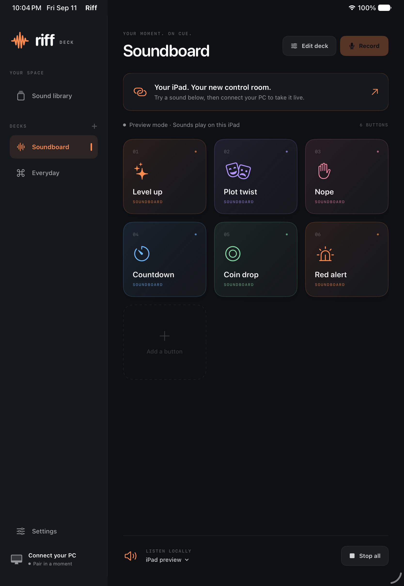

# Riff

Riff turns your iPad into a soundboard and control deck for your Windows PC. Play clips in game chat, trigger keyboard shortcuts, launch apps, or put a few repetitive actions behind one button.

It's a native SwiftUI app with a Windows companion. Both run on your own devices, over your local network. Core features need no account or subscription. Optional AI suggestions use your OpenAI API account.

<p align="center">
  
</p>

## What it does

- **Soundboard:** play overlapping clips, replace them one at a time, or queue them in order, tap a playing button to stop it, or stop everything at once. Six original sounds are included.
- **Recording and imports:** record on your iPad or import WAV, MP3, M4A, AAC, and AIFF files. Trim clips with a waveform editor and listen before saving.
- **Private previews:** library previews play on your iPad, even while connected to your PC. Imported and recorded sounds require a companion with iPad preview support. Deck buttons and explicit PC audio tests use your saved Windows output.
- **Custom decks:** create, edit, duplicate, delete, and rearrange decks and buttons without a PC connection. Changes save on the iPad and sync automatically when the companion connects. Choose colors, symbols, and emoji, adjust the grid, and add several library sounds at once.
- **AI button suggestions:** optionally use GPT-5.6 Luna to suggest a label, icon, and color automatically while creating a button. Your manual choices are preserved.
- **AI starter decks:** choose a game, link an app, or describe a new space to suggest a starter set of sounds and controls. Review the choices before creating it.
- **PC controls:** send keyboard shortcuts, type text, control media, open websites, and launch apps you've approved on Windows. Chain up to 20 actions into a sequence.
- **Tap, double-tap, and hold:** assign up to three actions to one button, with separate gesture controls and VoiceOver actions.
- **Pinned buttons and layout sharing:** keep important controls on every page; export and import decks or individual buttons, with resource matching for another PC.
- **More control actions:** alternate between two sequences, trigger a random action, open another deck, go back, or assign Stop all to a button.
- **App profiles:** link a deck to an approved Windows application and switch when that app gets focus.
- **Steam decks:** link a deck to a Steam game and switch to it automatically when the game starts.
- **Voice chat:** send clips to a virtual microphone for Discord or in-game chat. This needs a separate audio driver; setup is below.

Riff is still early. Builds and automated tests cover parts of the app, but physical iPad and Windows testing is still needed. The [verification notes](docs/VERIFICATION.md) track those gaps. Bug reports and device-testing feedback are welcome.

## Get started

You'll need an iPad running **iPadOS 17 or later** and a **Windows 11** PC on the same local network. The iPad app needs to stay open while you use it as a control deck.

### Windows

Download the companion from [GitHub Releases](https://github.com/binbandit/riff/releases/latest):

- `Riff-<version>-win-x64.zip` for Intel or AMD PCs.
- `Riff-<version>-win-arm64.zip` for ARM PCs.

1. Extract the whole ZIP. Keep the `Sounds` folder beside `Riff.Companion.exe`.
2. Run `Riff.Companion.exe`. The download includes .NET, so you don't need to install a runtime.
3. Allow Riff through Windows Firewall on **Private** networks.
4. Under **Connect iPad**, select your PC's home Wi-Fi or Ethernet address, rather than a VPN address.

The Windows build is unsigned. Closing the window leaves Riff running in the system tray; choose **Quit Riff** from the tray menu to exit.

If a release isn't available yet, development downloads are attached to successful runs of [Build and release Windows companion](https://github.com/binbandit/riff/actions/workflows/companion.yml). Downloading workflow artifacts requires a GitHub account.

### iPad

The iPad app currently needs signing with your own Apple account. There are two ways to install it.

**From a Mac:** clone this repository and open `Riff.xcodeproj` in Xcode. Choose your Apple development team under **Signing & Capabilities**, changing the bundle identifier if Xcode requests it. Connect your iPad, select it as the run destination, and run the app. Use Xcode with Swift 6.2 or later.

**From Windows:** download `Riff-iPad-unsigned.ipa` from a successful [Build and test iPad](https://github.com/binbandit/riff/actions/workflows/build.yml) run. Install [Sideloadly](https://sideloadly.io/), follow its device-driver setup instructions, then connect your iPad by USB and trust the PC. Load the IPA in Sideloadly and sign it with your Apple account. This installation route still needs physical-device testing for Riff.

Enable Developer Mode and trust the development app if prompted. Allow local-network access when you open Riff; microphone and camera permissions are requested when you record or scan a pairing code.

Free Apple signing expires after **7 days**, so you'll need to sign the app again or set up a refresh tool. See [Apple's account details](https://developer.apple.com/help/account/basics/about-your-developer-account) and the [Sideloadly FAQ](https://sideloadly.io/faq) for signing and refresh requirements.

### Connect your PC

On iPad, tap **Connect your PC**, scan the companion's QR code, then tap **Connect PC**. You can also paste the pairing link if scanning isn't available.

Keep that link and QR code private: they grant access to your PC controls. Pairing uses an access key and HTTPS with certificate pinning. The iPad stores the pairing details in Keychain; Windows protects its key with your Windows user account. Use **Revoke paired devices** in the companion to invalidate old links.

If the connection fails, check that both devices are on the same network, local-network permission is enabled on iPad, and Windows Firewall allows Riff on private networks. Guest Wi-Fi may block devices from reaching each other. If the PC's IP address changes, scan a new pairing code.

An optional [firewall script](scripts/allow-private-network.ps1) can add a rule for the executable on TCP port 49321, limited to private networks and the local subnet. Run it in an administrator PowerShell with the full executable path. Riff is intended for your local network; don't forward that port on your router.

## Using the soundboard

Deck editing works before pairing and while your PC is offline. Saved changes survive restarting the app and sync on the next connection while Riff is open. Changes to different decks, buttons, and appearance fields are merged; if both devices change the same field, the pending iPad edit wins. Local deletions are also synced. Saving finishes locally; transfers and retries run quietly in the background without blocking further edits. Failed transfers keep the local edits for retry, including when the PC saved a change but its reply was interrupted.

Games discovered on your PC are remembered on the iPad, including when a Steam library drive is temporarily unavailable. After connecting once, you can choose those games and your saved allowed applications while creating or configuring decks offline. Newly discovered games and updated names arrive automatically; pairing a different PC starts its own game list. Allowed applications and audio outputs keep the latest list received from the PC.

Library sounds already known to the iPad can be assigned offline. Copying new audio to the PC and running PC actions still need the companion. AI suggestions can use the iPad’s own setup with just an internet connection. If a referenced sound or allowed app was removed on the PC, or the companion needs an update, the edits stay on the iPad and are retried automatically as the PC becomes ready. Grid preferences remain specific to this iPad.

To add several library sounds to a board, open **+ → Add sounds from library** on the board, select sounds (or **Select shown**), then tap **Add … to [deck name]**. In the Sounds library, **Quick add** opens the same selection flow. Buttons follow selection order, existing sound buttons are skipped, and each deck holds up to 48 buttons. You can also choose another deck or create one.

For files, use **Sounds → + → Import audio files** and select several at once, then **Import all**. Filenames become sound names, progress and individual failures are shown, and successful imports can be added to a deck together. Files longer than 60 seconds must be imported individually for trimming. The Windows companion’s **Import sounds from PC** also accepts multiple files.

Tap the output label below the deck, or open **… → Sound controls**, to choose volume, output, and playback mode. **Overlap** layers effects; **One at a time** replaces the previous clip; **Queue** waits for each sound to finish before starting the next. Waiting buttons show their queue position. Tap a waiting button to remove it, or tap the playing button to skip to the next sound. Up to 48 sounds can wait in the queue. Switching to another mode clears waiting sounds on your next tap. **Stop all** stops sounds, clears the queue, and cancels any remaining sequence steps. Queue mode requires an updated Windows companion and also works with offline iPad sounds.

Recordings and saved clips can be up to 60 seconds long. On iPad, you can import a file up to 10 minutes long and 100 MB in size, at 96 kHz or below, then trim it before upload. Direct Windows imports are limited to 20 MB and 60 seconds. Trimming leaves the original file unchanged.

Use **Sounds → Select → Add to deck** to build a deck from several clips. Favorites and search help you find them again. Long-press a button to duplicate it, or change its deck in the editor to move it. **… → Grid size** sets the rows and columns for each deck.

Without a PC connection, you can create and edit decks and play bundled sounds on the iPad. PC actions need a connection.

### AI button suggestions

On the iPad, open **Settings → AI suggestions**, paste your OpenAI API key, and select **Enable suggestions**. You can also open setup directly from a button, bulk addition, or starter deck editor. The key stays in this iPad’s Keychain and is sent only to OpenAI. Suggestions work without pairing or connecting a PC.

Alternatively, enable suggestions under **Controls → AI button suggestions** in the Windows companion. That key is encrypted for your Windows account and never sent to the iPad. Riff uses the iPad key when configured; otherwise it can use the companion while connected. OpenAI API usage is billed separately to your OpenAI account; your key needs access to `gpt-5.6-luna`.

When adding a button on the iPad, Riff automatically suggests its label, icon, and color after you choose or change its action. Typing a label also helps guide the icon and color. Your manual choices stay in place, existing and duplicated buttons keep their appearance, and you can turn off **AI suggestions** in the editor. Suggestions never change or run the action. Saving does not wait for AI, and still works if suggestions fail.

Bulk additions use the same AI setup. Select sounds in **Quick add**, including sounds from a bulk import, then review the suggested labels, icons, and colors together before adding them. Riff requests the whole set at once, considers the destination deck’s linked game or app, and preserves the sounds, selection order, existing buttons, and your manual edits. Turn **AI suggestions** off to use the original appearances; adding still works offline or if AI fails.

Enabling suggestions sends the selected sound, app, or destination deck name, action details (including typed text and sequence steps), and a label you type to OpenAI directly from the iPad, or through the companion when using its key. Audio files, app executable paths, and pairing keys are not sent. Website query strings, fragments, and embedded credentials are removed. Responses use `store: false`. Choose **Remove key from this iPad** in AI settings to remove the local key, or **Disable & remove key** on Windows to remove the companion key. The editor’s AI toggle stops suggestions for that edit.

### AI starter decks

Create a new deck and select a **Linked game**, link an application, or describe what the space is for under **Start with AI**. With AI set up on your iPad or connected Windows companion, GPT-5.6 Luna automatically suggests a name, icon, and starter buttons with colors, labels, and short explanations.

Deselect anything you don't want, then choose **Create deck**. All bundled sounds are already in the library on both devices. You can also turn suggestions off or choose **Create empty deck**, including while AI is loading or unavailable. Deck changes save on the iPad and sync to the PC. If sync fails, they remain saved and retry when connected. Existing decks are never replaced by suggestions.

Suggestions use actual sounds from your current library, plus Stop all and configured controls. Soundboard mode limits suggestions to sounds and Stop all. In desktop mode, existing controls and media controls can also be suggested. Riff does not invent game shortcuts, download new game audio, or execute suggested actions. Available sounds may only loosely fit a game, and the suggestion explains that when appropriate.

All 138 included sounds are ready immediately, with no pack downloads or installation. **Sounds** and the sound picker organize them into expandable categories, alongside **Riff essentials** and **My sounds**. Search finds sounds across groups. Swipe or hold a sound to delete it after removing it from buttons; deletion stays saved after restarting and syncs automatically when connected.


Starter suggestions send the selected game/app name, your description and name hint, available sound names, and existing button names to OpenAI. Existing button action values and app executable paths are excluded. The same securely stored API key and `gpt-5.6-luna` model are used as for individual button suggestions.

### Send clips to voice chat

With [VB-CABLE](https://vb-audio.com/Cable/) installed on Windows, the audio route is:

**Riff → CABLE Input → CABLE Output → your chat app's microphone input**

1. In Riff's Windows audio settings, select **CABLE Input** and apply the change.
2. In Discord or your game, select **CABLE Output** as the microphone.
3. Open the chat app's microphone test and play a sound from Riff.
4. Use voice activation, or hold your push-to-talk key while the clip plays. Riff sends shortcut taps, so it can't hold that key for you.

If clips get cut off, check the chat app's voice threshold and noise suppression settings. To hear the clips yourself, open **Sound controls**, turn on **Hear sounds myself**, select your PC headphones, and **Apply**. **Headphone volume** changes only your local copy; **Sound volume** controls the output sent to chat. The Windows companion has the same controls under **Audio & voice chat**. This requires an updated companion. If you already listen through Windows or Voicemeeter, use just one monitoring route to avoid an echo.

Riff can play to your chat output and headphones together, but doesn't mix your microphone with clips. For both at once, you'll need a separate mixer, such as [Voicemeeter](https://vb-audio.com/Voicemeeter/). These audio tools are separate downloads and aren't bundled with Riff.

For the new action switches, random actions, deck navigation, and app profiles, see the [Stream Deck feature comparison and guide](docs/STREAM-DECK-FEATURES.md).

### Steam and other controls

Link a game under **Deck settings**, then enable **Follow my Steam game** in Settings. Riff reads Steam's local library and running-game data; it doesn't need your Steam login or an API key. Detection is best effort. If several games are running, select a deck manually.

Keyboard shortcuts and typed text go to the focused Windows app. To launch an application, first add its `.exe` under **Allowed apps** in the companion. Riff doesn't accept arbitrary shell commands from the iPad.

Riff doesn't run Elgato plugins or include a dedicated OBS integration. You can control OBS through its configured hotkeys. Elevated applications and protected games may block simulated input.

## Updates and backups

The iPad checks GitHub for new companion releases while Riff is open and paired. You can also check under **Settings → Companion updates**. To update Windows, quit Riff from the tray, extract the new ZIP into a new folder, and run the new executable. Your decks and clips stay in place. See [companion update details](docs/COMPANION-UPDATES.md).

Playback and PC controls work without internet access. Update checks contact GitHub, but don't send your pairing key, PC address, decks, or sounds.

Windows stores decks, clips, settings, and approved app paths in `%LOCALAPPDATA%\Riff`. Close Riff before backing up that folder. To move to another PC or Windows account, copy `state.json` and `clips` into a fresh Riff data folder, then pair again. Don't copy the protected identity files. App paths and audio-device settings may need updating.

## Development

The iPad app lives in `Riff/`, the C# Windows companion in `Companion/`, and the bundled sounds in `Shared/Sounds/`. Swift tests are in `Tests/`; companion tests live alongside the C# projects.

The iPad source is grouped by responsibility:

```text
Riff/
├── App/          App entry point and shared store
├── Models/       Decks, pads, clips, and companion snapshots
├── Design/       Themes, button styles, and shared glyphs
├── Features/
│   ├── Audio/       Playback controls and microphone/music setup
│   ├── Connection/  Pairing, QR scanning, and secure transport
│   ├── Decks/       Main board, layout, and button/deck editors
│   ├── Settings/    Preferences and appearance
│   ├── Sounds/      Library, recording, trimming, and sound packs
│   └── Updates/     Companion releases and Markdown changelogs
├── Preview/      Development preview scenarios
└── Resources/    Asset catalog, starter and pack audio, sound-pack catalog, and licenses
```

Keep feature-specific views and supporting logic together. Put app-wide models and reusable visual components in `Models/` and `Design/`. Xcode discovers files inside `Riff/` automatically; update `Package.swift` when adding portable code or excluding an iPad-only view from the Mac test target. The sound generator writes starter audio to both `Shared/Sounds/` and `Riff/Resources/Sounds/`.

Clone the repository first:

```sh
git clone https://github.com/binbandit/riff.git
cd riff
```

### iPad and shared Swift code

On a Mac with Xcode and Swift 6.2 or later:

```sh
swift test
xcodebuild -project Riff.xcodeproj -scheme Riff -sdk iphonesimulator \
  -destination 'generic/platform=iOS Simulator' CODE_SIGNING_ALLOWED=NO build
```

Run `./scripts/build-ipad.sh` to create an unsigned device build at `artifacts/Riff-iPad-unsigned.ipa`. Installing it on a physical iPad requires signing.

### Windows companion

On Windows with the .NET 10 SDK:

```powershell
./scripts/build-windows.ps1
# For ARM PCs:
./scripts/build-windows.ps1 -Runtime win-arm64
```

The script runs core and Windows HTTPS integration tests, then creates a self-contained ZIP under `artifacts/`. Close any running companion before testing because the integration test uses the same port. ARM64 packages are cross-compiled; they still need a launch check on an ARM PC.

The core C# tests also run on macOS with the .NET 10 SDK:

```sh
dotnet test Companion/Riff.Tests
```

### Releases

The [Windows workflow](.github/workflows/companion.yml) tests and packages relevant pull requests. Relevant pushes to `main` publish a companion release after both Windows builds pass. iPad builds use a [separate workflow](.github/workflows/build.yml); iPad-only changes and README edits don't trigger companion releases.

Companion versions use tags such as `companion-v0.1.0`. Commit messages determine the version bump: `fix(companion): ...` bumps patch, `feat(companion): ...` bumps minor, and `!` or a `BREAKING CHANGE:` footer bumps major. Changed file paths determine which commits belong to a companion release. Other relevant changes bump patch.

The workflow generates release notes and changelogs from Git history. Use clear commit subjects, and let the workflow create version tags and changelogs.

## Contributing

[Issues](https://github.com/binbandit/riff/issues) and pull requests are welcome. For a bug, include your iPadOS and Windows versions, the companion version, what you expected, and the steps to reproduce it. Screenshots help with UI problems; leave pairing links and QR codes out of them.

For a larger change, open an issue first so we can talk through it. Keep pull requests focused, run the tests for the code you change, and say what you tested on real devices versus a simulator. If you have an iPad and Windows PC, working through the [device checks](docs/VERIFICATION.md) is a useful way to help.

Dependency licenses and notices are listed in [THIRD-PARTY.md](docs/THIRD-PARTY.md).
